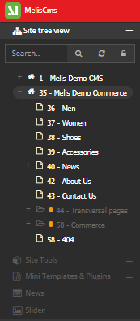
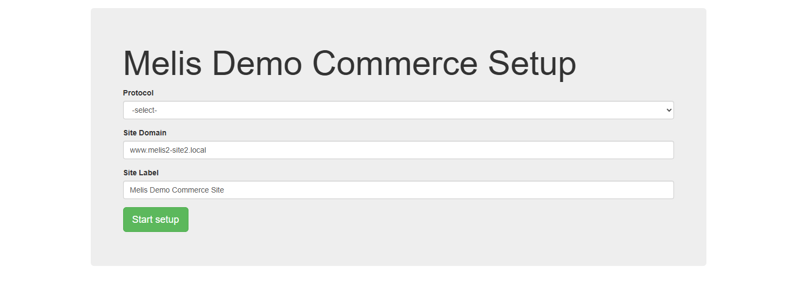

# MelisDemoCommerce — AI & developer guide

> **Module:** `melisplatform/melis-demo-commerce` · **Namespace:** `MelisDemoCommerce` · **`melis-site: true`**
> · installer-name `MelisDemoCommerce`
> **What it is:** a **ready-made demo e-commerce *site*** for MelisPlatform — the commerce counterpart of
> [`melis-demo-cms`](../../../melis-demo-cms/etc/MelisAI/doc/MelisDemoCms.md). It’s a full storefront (catalog,
> product/variant pages, cart, checkout, account, orders) on top of
> [`melis-commerce`](../../../melis-commerce/etc/MelisAI/doc/MelisCommerce.md), plus a **seeded demo catalog**
> and — most useful for developers — **worked integration patterns**: a (fake) **payment gateway**, **custom
> shipping**, and per-site plugin customization. Three screenshots are bundled.

---

## 0. Where it sits — a demo *and* a reference implementation

This module wears two hats:

1. **A demo site** you install to *see* MelisCommerce working as a real shop.
2. **A copy-from reference** showing the exact wiring a real shop needs: how to build a storefront from the
   commerce front-office plugins, **how to plug a payment method into checkout**, how to compute **shipping**,
   and how to customise the commerce plugins per-site.

| Related | Relationship | Doc |
|---|---|---|
| **MelisCommerce** | the engine this site demonstrates (catalog/cart/checkout/orders, the FO plugins). | [MelisCommerce](../../../melis-commerce/etc/MelisAI/doc/MelisCommerce.md) |
| **MelisDemoCms** | the **same site-module pattern** (`melis-site: true`, `.dist` config, a `/setup` wizard). Read it for the page-composition techniques; this doc focuses on the *commerce* additions. | [MelisDemoCms](../../../melis-demo-cms/etc/MelisAI/doc/MelisDemoCms.md) |
| **MelisCms / MelisFront / MelisEngine** | the CMS/front engine the storefront pages render through. | [MelisCms](../../../melis-cms/etc/MelisAI/doc/MelisCms.md) |

**Composer deps:** `melis-commerce`, `melis-cms`, `melis-cms-slider`, `melis-cms-prospects`, `melis-cms-news`,
`melis-cms-page-script-editor` (all `^5.2`). **Prerequisite:** a working platform with **MelisCommerce already
installed** (its `melis_ecom_*` tables + reference data present) — the wizard *adds a site*, it doesn’t install
the engine.

---

# PART A — Functional guide

## A1. The storefront

Once installed, the site is a clothing shop: a header menu (**MEN / WOMEN / SHOES / ACCESSORIES / NEWS / ABOUT
US / CONTACT US**), product cards with prices, and merchandising tabs (*Best Seller / New Arrivals / Special
Offer*) — all rendered from MelisCommerce front-office plugins (§B3).


In the back office it appears as its own **site tree** (here *“35 - Melis Demo Commerce”*, coexisting with
*“1 - Melis Demo CMS”*) with the category pages (Men/Women/Shoes/Accessories), News, About Us, Contact Us, a
*Transversal pages* group, a *Commerce* folder and a 404:



The full shopper journey is live: browse a category → open a product → pick a variant → **add to cart** →
log in / register → **checkout** (addresses → shipping → **payment** → confirmation) → see the order in **My
account → Orders**, including **returns**.

## A2. Installing it — the setup wizard

Like the CMS demo, this is a **site module**: Composer drops it in `vendor/`, you register its path, then you
open **`/MelisDemoCommerce/setup`** on a domain not yet bound to another site:



You give a **Protocol**, a **Site Domain** and a **Site Label**, press **Start setup**, and the wizard runs
**~15 steps** that create the site, its pages/templates, sliders and news, **then the whole commerce catalog**
(attributes → products → categories → variants → prices → stock), a **coupon**, and **sample clients/orders**.
It resolves all database IDs at runtime and writes them back into the site’s generated config (the `[:token]`
placeholders in `config/*.dist`), so it installs cleanly onto a platform that already hosts other sites.

> **Two install caveats (from the README, worth repeating):** ① **Do NOT** add `MelisDemoCommerce` to the
> back-office module list (`config/melis.module.load.php`) — that makes every `/MelisDemoCommerce/*` URL a
> back-office request and the wizard becomes unreachable. It belongs in the **path map**
> (`config/melis.modules.path.php`) and is served as a front site via its vhost `MELIS_MODULE`. ② MelisCommerce
> must already be installed (engine + reference data), since the wizard only seeds *catalog content*.

## A3. How do I…?

- **…try the shop?** Install (§A2), then browse the front domain — everything from catalog to a placed order
  works out of the box, **including a fake payment step** so you can complete a checkout without a real gateway.
- **…use it as a starting template for a real shop?** Copy this module’s structure: the per-site plugin
  templates (`melis.plugins.config`), the checkout payment/shipping listeners (§B4–B5), and the views, then
  **replace the fake payment** with a real gateway and the demo shipping with your rates.

---

# PART B — Technical reference

## B1. It’s a site module (the MelisDemoCms pattern)

`melis-site: true`; runtime config is generated from **`.dist`** templates (`module.config.php.dist`,
`melis.plugins.config.php.dist`, `MelisDemoCommerce.config.php.dist`) with `[:token]` placeholders the wizard
fills with real IDs. Routes: a homepage `/` (via `MelisFront\Controller\Index`), the generic
`/MelisDemoCommerce/[:controller[/:action]]`, and **`/MelisDemoCommerce/setup[/:action]`** →
`SetupController` (`setup` / `executeSetup`). `SetupController::executeSetupAction` runs the wizard step machine,
each step `include`-ing a `MelisDemoCommerce.<step>.setup.php` data file from the install dir (… → `coupons` →
clients/orders).

**Front controllers** (`src/MelisDemoCommerce/Controller/`): `Home`, `ComCatalogue`, `ComProduct`,
`ComCheckout`, `ComMyAccount`, `ComOrder`, `ComLogin` / `ComLogout` / `ComLostPassword`, `Contact`, `News`,
`Search`, `About`, `Testimonial`, `Page404`, **`FakeServerPaymentController`** (the demo gateway endpoint),
`Setup`, `Test`.

## B2. The storefront = MelisCommerce plugins, templated per-site

The shop pages are built from MelisCommerce’s front-office **templating plugins**; this site supplies its own
**`template_path`** (and JS/CSS) for each via `config/melis.plugins.config.php.dist` — e.g.
`MelisCommerceCategoryProductListPlugin` → `MelisDemoCommerce/plugin/category-product-list-slider`, plus
`ProductSearch`, `CategoryTree`, `ProductPriceRange`, `ProductAttribute`, `ProductList`, `RelatedProducts`, the
cart and the checkout chain. So the storefront is **0% bespoke commerce logic** — it is the engine’s plugins
wearing this site’s templates. (This is the per-site plugin-template mechanism from MelisCms.)

## B3. Customising plugin output — the `Site*PluginListener` family

Where a template override isn’t enough, the site attaches **listeners that adjust a plugin’s parameters or
results** before it renders: `SiteCommerceProductListPluginListener`, `SiteCommerceCategoryProductListPluginListener`,
`SiteCommerceProductPriceRangePluginListener`, `SiteCommerceRelatedProductsPluginListener`,
`SiteProductShowPluginListener`, `SiteCheckoutCartPluginListener`, `SiteCheckoutConfirmPluginListener`,
`SiteCartPluginListener`, `SiteOrderPluginListener`, `SiteOrderReturnProductPluginListener`, plus
`SiteMenuCustomizationListener` and `SiteBreadcrumbCustomizationListener`. They all extend `SiteGeneralListener`
and follow the MelisCommerce event convention (mutate `$params` / `$params['results']`).

## B4. ⭐ Wiring a payment method into checkout (the pattern to copy)

This is the most reusable thing in the module. A payment method **registers by listening on the checkout’s
payment event** and rendering its own payment form into the checkout step:

```php
// SiteFakePaymentListener — a payment method for checkout
$this->attachEventListener(
    $events, '…', 'meliscommerce_checkout_plugin_payment',
    function ($e) {
        $params    = $e->getParams();
        $viewModel = /* … */;
        $viewModel->setTemplate('MelisDemoCommerce/plugin/checkout-fake-payment');   // this method's payment UI
        // build the method's form, seeded with the order total from the checkout:
        $paymentForm = /* createForm(MelisDemoCommerce_checkout_fake_payment_form) */;
        $paymentForm->setData(['payment-transaction-total-cost' => $params['orderDetails']['totalCost'], …]);
        $viewModel->setVariable('fakePaymentForm', $paymentForm);
        // …return the view so checkout shows this payment option…
    }
);
```

The demo ships **two methods** to show the pattern is pluggable — a **server gateway** style
(`SiteFakePaymentListener` + `SiteFakePaymentProcesstListener`, backed by `FakeServerPaymentController`) and a
**PayPal-style** redirect (`SiteFakePaypalStyleListener` + `SiteFakePaypalStyleProcesstListener`). The `…Process`
listeners handle the gateway’s return and feed the result into MelisCommerce’s
`checkoutStep2_postPayment` (the engine then records the transaction and moves the order off status `-1`).

> **To use a real gateway:** copy a fake listener, point the payment template at your provider’s form/redirect,
> and in the process listener pass the provider’s transaction values into the engine’s post-payment step. The
> demo gateways are intentionally **fake** — never ship them to production.

## B5. Custom shipping cost (the same pattern, one event up)

Shipping is computed by **listening on the engine’s shipment-computation event** and delegating to a site
service:

```php
// SiteShipmentCostListener
$this->attachEventListener(
    $events, '…',
    ['meliscommerce_service_checkout_shipment_computation_end',
     'meliscommerce_service_checkout_post_shipment_computation_end'],
    function ($e) use ($sm) {
        $params  = $e->getParams();
        $service = $sm->get('SiteShipmentCostService');
        $params['results'] = $service->computeShipmentCost($params['results']);   // your rate logic
        return $params;
    }
);
```

`SiteShipmentCostService::computeShipmentCost($shipment)` is where a real shop puts its carrier/zone/weight
rules. This is the canonical example of the MelisCommerce **“extend by `_end` listener, rewrite
`$params['results']`”** model (see MelisCommerce §B1/§B10).

## B6. Services & code map

- **Services:** `DemoCommerceService` (site helpers used by the wizard/controllers), `SiteShipmentCostService`
  (the shipping calculator, §B5).
- **Forms:** `DemoSiteFieldCollection` / `DemoSiteFieldRow` view helpers; the fake-payment form
  (`MelisDemoCommerce_checkout_fake_payment_form`) in `config/app.forms.php`.

```
config/
  *.dist                       ← runtime config generated by the wizard ([:token] → real IDs)
  melis.plugins.config.php.dist← per-site template_path for each MelisCommerce FO plugin (§B2)
  app.forms.php · assets.config.php · module.load.php
src/MelisDemoCommerce/
  Controller/  Home · ComCatalogue · ComProduct · ComCheckout · ComMyAccount · ComOrder · ComLogin/Logout/LostPassword
               · Contact · News · Search · About · Testimonial · Page404 · FakeServerPayment · Setup
  Listener/    Site*PluginListener (plugin customisation) · SiteFakePayment* / SiteFakePaypalStyle* (payment) ·
               SiteShipmentCostListener · SiteMenu/Breadcrumb customisation · SiteGeneralListener (base)
  Service/     DemoCommerceService · SiteShipmentCostService
  Form/View/Helper/ …
view/          ← 85 storefront templates (incl. plugin/checkout-fake-payment, category-product-list-slider, …)
install/       ← MelisDemoCommerce.<step>.setup.php seed-data files (catalog, coupon, clients, orders)
```

---

## Screenshot index

| File | Shows |
|---|---|
| `images/melisdemocommerce-homepage.png` | The demo storefront homepage (menu + product cards + merchandising tabs). |
| `images/melisdemocommerce-menu-sitetreeview.png` | The back-office **site tree** of *Melis Demo Commerce* (category pages, News, Commerce folder, 404), beside the CMS demo. |
| `images/melisdemocommerce-setup.png` | The **`/MelisDemoCommerce/setup`** wizard (Protocol / Site Domain / Site Label → Start setup). |

*The promo images under `etc/MarketPlace/` are kept separate. Front-office shop pages beyond the homepage
(product, cart, checkout, account) and the wizard’s later steps aren’t captured yet — add them under `./images/`
and extend this index.*
